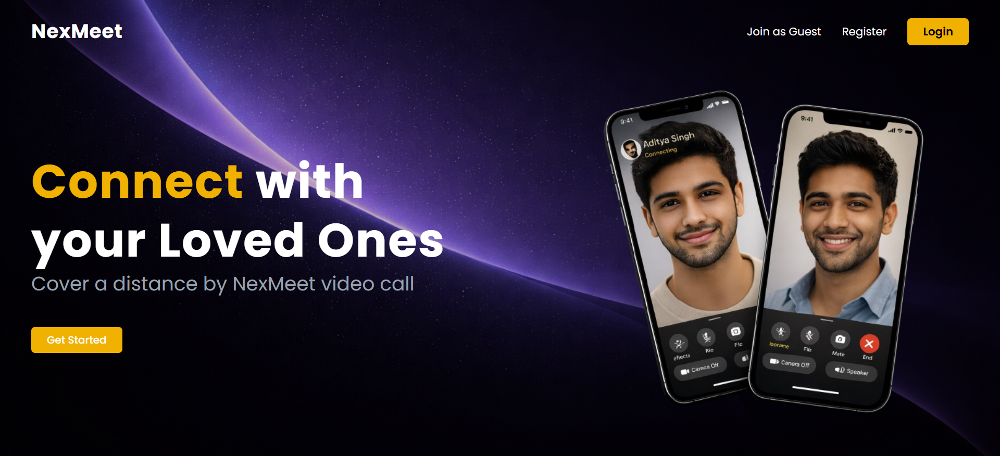
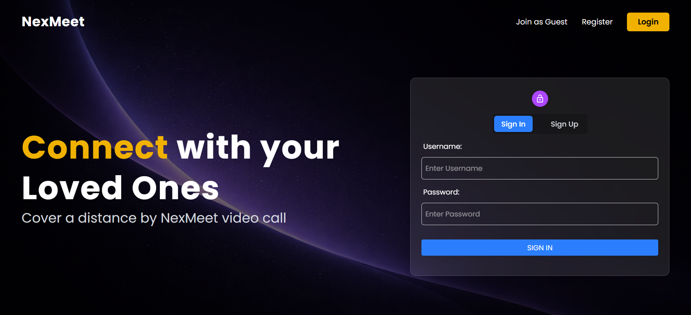
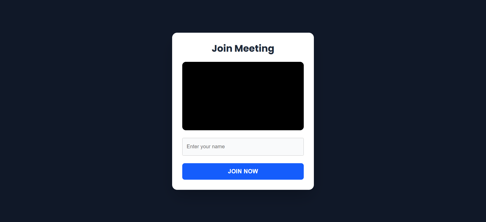
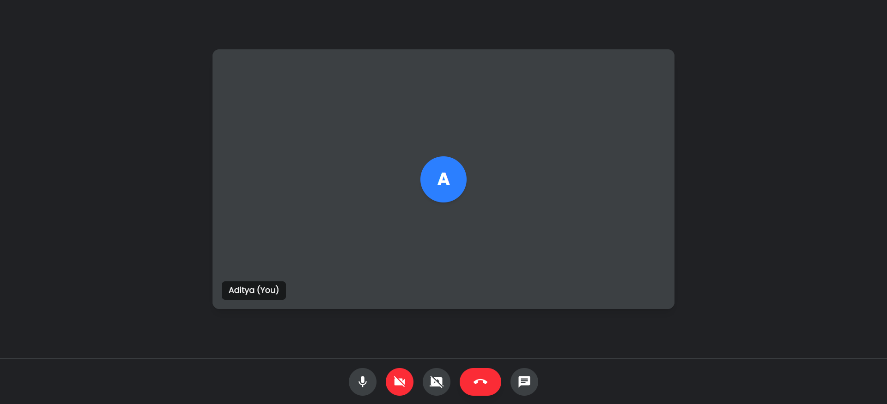
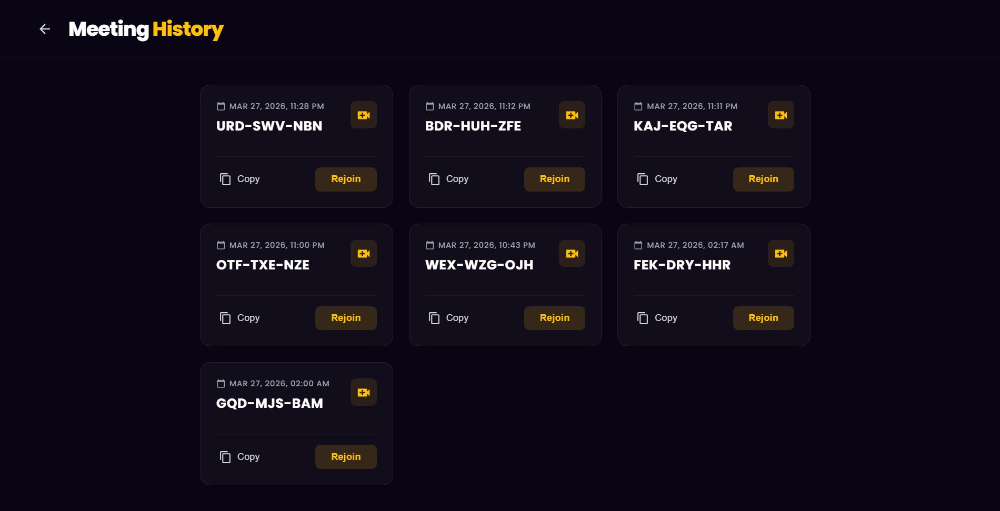

<div align="center">

<!--  -->

# 🌐 NexMeet  

### 🚀 Real-Time Video Conferencing & Collaboration Platform  

**Seamless, low-latency meetings powered by WebRTC & Socket.io**

---

### 🧰 Tech Stack  


---

[🌍 Live Demo](https://nexmeet-z6qy.onrender.com) 

</div>

---

## 📌 Overview  

**NexMeet** is a full-stack, real-time video conferencing platform designed to deliver a seamless and secure communication experience.  

It utilizes **WebRTC for peer-to-peer media streaming** and **Socket.io for real-time signaling**, ensuring ultra-low latency and high-quality interactions.

The platform features a **modern glassmorphic UI**, optimized for responsiveness across all devices.

---

## ✨ Key Features  

- 🎥 **High-Quality Video & Audio**  
  Real-time peer-to-peer streaming using WebRTC  

- 💬 **Real-Time Chat System**  
  Instant messaging powered by Socket.io  

- 🖥️ **Screen Sharing**  
  Present and collaborate efficiently  

- 🔒 **Secure Authentication**  
  JWT-based authentication with encrypted credentials  

- 📅 **Meeting History Tracking**  
  Stores and retrieves previous sessions  

- 📱 **Responsive UI Design**  
  Works seamlessly on mobile and desktop  

- 🎛️ **Interactive Media Controls**  
  Mute/unmute, toggle video, leave room  

---

## 🧠 System Architecture  

```text
Client (React + WebRTC)
        │
        ▼
Signaling Server (Node.js + Express + Socket.io)
        │
        ▼
Database (MongoDB)
```

---

## 🛠️ Tech Stack  

### 🔹 Frontend  
- React.js (Vite)  
- Tailwind CSS + Material UI  
- React Router DOM  
- WebRTC / Simple-Peer  

### 🔹 Backend  
- Node.js  
- Express.js  
- Socket.io  
- MongoDB (Mongoose)  
- JWT Authentication + bcrypt  

---

## 📸 Screenshots  

### 🏠 Landing Page  
<div align="center">
  
</div>

---

### 🔐 Authentication (Login / Signup)  
<div align="center">
  
</div>

---

### 🧑‍💻 User Dashboard  
<div align="center">
  
</div>

---

### 📞 Join Meeting Page  
<div align="center">
  
</div>

---

### 🎥 Video Call Interface  
<div align="center">
  
</div>

---

### 📜 Call History  
<div align="center">
  
</div>

---

## 📁 Project Structure  

```bash
NexMeet/
├── backend/                 # 🚀 Backend (Node.js + Express + Socket.io)
│   ├── src/
│   │   ├── controllers/     # 🎯 Business logic
│   │   │   ├── socketManager.js   # Real-time signaling logic
│   │   │   └── user.controller.js # Auth & user operations
│   │   │
│   │   ├── models/          # 🗄️ Database schemas (MongoDB)
│   │   │   ├── meeting.model.js
│   │   │   └── user.model.js
│   │   │
│   │   ├── routes/          # 🛣️ API routes
│   │   │   └── users.routes.js
│   │   │
│   │   └── app.js           # ⚙️ Express app configuration
│   │
│   ├── package.json
│   └── pnpm-lock.yaml
│
└── frontend/                # 🎨 Frontend (React + Vite)
    ├── public/              # 🌐 Static assets
    │
    ├── src/
    │   ├── assets/          # 🖼️ Images & UI assets
    │   │
    │   ├── components/      # 🧩 Reusable UI components
    │   │   ├── LandingHero.jsx
    │   │   └── Navbar.jsx
    │   │
    │   ├── contexts/        # 🌍 Global state (Auth)
    │   │   └── AuthContext.jsx
    │   │
    │   ├── pages/           # 📄 Application pages
    │   │   ├── Authentication.jsx
    │   │   ├── HomePage.jsx
    │   │   ├── Landing.jsx
    │   │   ├── MeetingHistory.jsx
    │   │   └── VideoMeet.jsx
    │   │
    │   ├── utils/           # 🛠️ Utility functions
    │   │   └── withAuth.jsx
    │   │
    │   ├── App.jsx          # Root component
    │   ├── main.jsx         # Entry point
    │   └── environment.js   # API configuration
    │
    ├── index.html
    ├── package.json
    └── vite.config.js
```

## 💻 Getting Started  

### 🔧 Prerequisites  

- Node.js (v16+)  
- MongoDB (Local / Atlas)  
- pnpm  

---

### ⚙️ Installation  

#### 1. Clone Repository  

```bash
git clone https://github.com/yourusername/nexmeet.git
cd nexmeet
```

---

#### 2. Backend Setup  

```bash
cd backend
pnpm install
```

Create `.env` file:

```env
PORT=8000
MONGO_URI=your_mongodb_connection_string
```

Run backend:

```bash
pnpm run dev
```

---

#### 3. Frontend Setup  

```bash
cd frontend
pnpm install
```

Create `.env` file:

```env
VITE_SERVER_URL=http://localhost:8000/;

VITE_USER_API_URL=http://localhost:8000/api/users

VITE_IS_PROD=false
```

Run frontend:

```bash
pnpm run dev
```

---

### 🌍 Run Application  

Open in browser:  
👉 http://localhost:5173  

---

## 🚀 Deployment Notes  

- Configure **SPA rewrites** to avoid 404 on routes  
- Enable **CORS** for frontend domain  
- Deploy using **Render / Vercel**  

---

## 🤝 Contributing  

Contributions are welcome!  

```bash
git checkout -b feature/YourFeature
git commit -m "Add feature"
git push origin feature/YourFeature
```

Open a Pull Request 🚀  

---


<div align="center">

### 💙 Built by Aditya Singh  

</div>